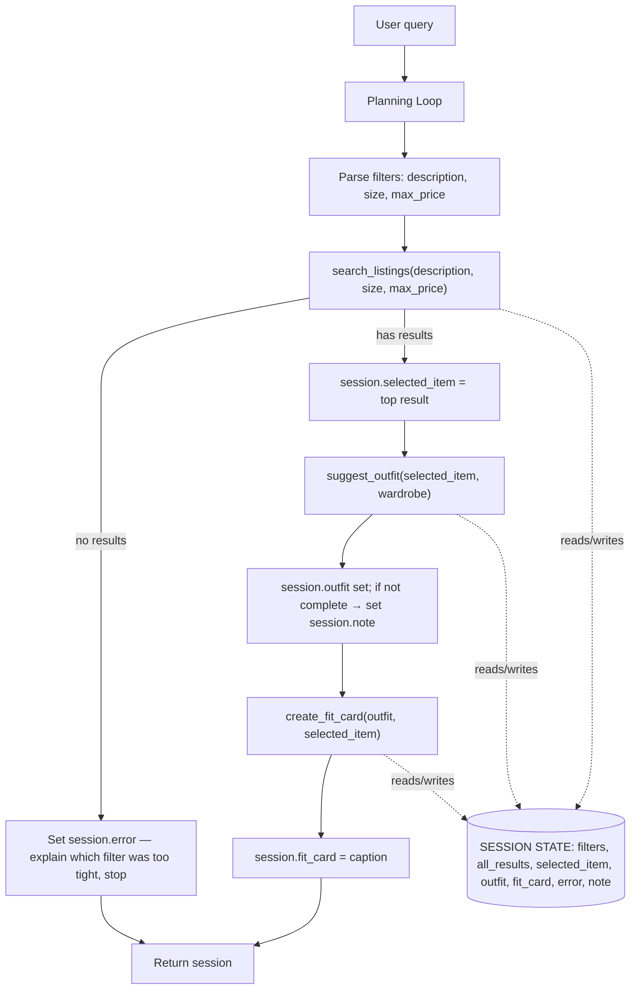

# FitFindr — planning.md

> Complete this document before writing any implementation code.
> Your spec and agent diagram are what you'll use to direct AI tools (Claude, Copilot, etc.) to generate your implementation — the more specific they are, the more useful the generated code will be.
> Your planning.md will be reviewed as part of your submission.
> Update it before starting any stretch features.

---

## Tools

List every tool your agent will use. For each tool, fill in all four fields.
You must have at least 3 tools. The three required tools are listed — add any additional tools below them.

### Tool 1: search_listings

**What it does:**

<!-- Describe what this tool does in 1–2 sentences -->

Filters the mock listings dataset by a free-text style/description query plus optional size and price constraints, and returns the matching listings ranked by how well they match the query (most relevant first).

**Input parameters:**

<!-- List each parameter, its type, and what it represents -->

- `description` (str): free-text description of the desired item, e.g. "vintage graphic tee". Tokenized and matched against each listing's title, description, style_tags, category, and colors.
- `size` (str): desired size, e.g. "M". If None, size is not filtered. Matched case-insensitively as a substring against the listing's size field (so "M" can match "M", "S/M", "M/L").
- `max_price` (float): : price ceiling in dollars. Only listings with price <= max_price are kept. If None, no price filter is applied.

**What it returns:**

<!-- Describe the return value — what fields does a result contain? -->

A list[dict] sorted by descending relevance. Each element is a full listing dict copied from listings.json (id, title, description, category, style_tags, size, condition, price, colors, brand, platform) plus one added key:

relevance_score (float): the computed match score used for sorting (style_tags hits weighted highest, then title/category/colors).

Returns an empty list [] when nothing passes the filters.

**What happens if it fails or returns nothing:**

<!-- What should the agent do if no listings match? -->

Returns [] — it never raises on "no matches." The planning loop detects the empty list, writes a user-facing error message into session state naming which filters were too restrictive, and stops without calling suggest_outfit. (Stretch: retry once with the size filter removed before giving up.)

---

### Tool 2: suggest_outfit

**What it does:**

<!-- Describe what this tool does in 1–2 sentences -->

Given one selected listing and the user's wardrobe, picks complementary wardrobe pieces that complete the look and writes a one-line styling note on how to wear the new item.

**Input parameters:**

<!-- List each parameter, its type, and what it represents -->

- `new_item` (dict): a single listing dict — the item the user is considering (the top result from search_listings).
- `wardrobe` (dict): wardrobe in schema format {"items": [ {id, name, category, colors, style_tags, notes}, ... ]}.

**What it returns:**

<!-- Describe the return value -->

A non-empty str containing 1–2 outfit suggestions. When the wardrobe has items, the string names specific wardrobe pieces to pair with the new item plus a short styling tip per outfit. When the wardrobe is empty, it gives general styling advice for the item instead. Pairings favor wardrobe pieces sharing the most style_tags/colors with new_item. Never returns an empty string.
Pieces are chosen by determining which categories complete the outfit relative to new_item.category (e.g. a top needs bottoms + shoes, optionally outerwear/accessories), then selecting wardrobe items in those categories that share the most style_tags/colors with new_item.

**What happens if it fails or returns nothing:**

<!-- What should the agent do if the wardrobe is empty or no outfit can be suggested? -->

If wardrobe["items"] is empty, it returns general styling advice (based only on new_item's style) as a string rather than failing. If the LLM call errors, it returns a short fallback string so the agent never crashes or returns "". The planning loop flags that an empty-wardrobe suggestion is generic and tells the user it can personalize once a wardrobe is added.

---

### Tool 3: create_fit_card

**What it does:**

<!-- Describe what this tool does in 1–2 sentences -->

Generates a short, casual, Instagram-caption-style description of the full outfit — the kind of thing someone would post when showing off a thrift find. Uses the LLM with non-zero temperature so output varies for different inputs.

**Input parameters:**

<!-- List each parameter, its type, and what it represents -->

- `outfit` (str): the outfit-suggestion string returned by suggest_outfit.
- `new_item` (dict): the selected listing, so the caption can reference price, platform, and the item itself.

**What it returns:**

<!-- Describe the return value -->

A str — one short caption (roughly 1–2 sentences, emoji allowed) referencing the new item, its price/platform, and the styling. Different inputs produce different captions.

**What happens if it fails or returns nothing:**

<!-- What should the agent do if the outfit data is incomplete? -->

If outfit is empty or whitespace-only, it returns a descriptive message string telling the user to run suggest_outfit first (does not raise). If the LLM call errors or returns an empty string, it falls back to a deterministic template, e.g. f"thrifted this {new_item['title']} off {new_item['platform']} for ${new_item['price']} ✨", so the agent always returns something shareable.

---

### Additional Tools (if any)

<!-- Copy the block above for any tools beyond the required three -->

None for the core build. (Planned stretch: estimate_price_fairness(item) — compares an item's price against same-category listings in the dataset and reports whether it's a fair deal.)

---

## Planning Loop

**How does your agent decide which tool to call next?**

<!-- Describe the logic your planning loop uses. What does it look at? What conditions change its behavior? How does it know when it's done? -->

The loop runs once per query and selects the next tool based on what the previous one returned. A session dict is carried through every step.

1. Parse the user query into filters:
   description = <style phrase from query>
   size = <size if mentioned, else None>
   max_price = <number if a price cap is mentioned, else None>
   Store these in session["filters"].

2. Call search_listings(description, size, max_price).
   results = the returned list.

   IF results == []:
   session["error"] = message naming which filters were too tight
   RETURN session # early exit: do NOT call suggest_outfit
   ELSE:
   session["selected_item"] = results[0] # highest relevance
   session["all_results"] = results

3. Call suggest_outfit(session["selected_item"], wardrobe).
   session["outfit"] = the returned string.
   IF wardrobe["items"] is empty: # suggestion will be generic
   session["note"] = "Gave generic styling — add wardrobe items for a personalized look."

   # continue either way

4. Call create_fit_card(session["outfit"], session["selected_item"]).
   session["fit_card"] = the returned caption.

5. RETURN session # selected_item, outfit, fit_card (+ any error/note)

The behavior is not fixed: the agent stops after step 2 when there are no results, and changes its messaging after step 3 when the wardrobe is empty. The full 3-tool chain only runs when each step produces usable output.

---

## State Management

**How does information from one tool get passed to the next?**

<!-- Describe how your agent stores and accesses state within a session. What data is tracked? How is it passed between tool calls? -->

A single session dict is created at the start of each query and passed by reference through the loop. Each tool reads what it needs from session and writes its result back, so later tools never require the user to re-enter anything.

| Key                                          | Set by       | Read by                              |
| -------------------------------------------- | ------------ | ------------------------------------ |
| filters (dict: description, size, max_price) | query parser | search_listings                      |
| all_results (list[dict])                     | step 2       | display / fallback                   |
| selected_item (dict)                         | step 2       | suggest_outfit, create_fit_card      |
| outfit (str)                                 | step 3       | create_fit_card, final output        |
| fit_card (str)                               | step 4       | final output                         |
| error (str or None)                          | any step     | controls early return + final output |
| note (str or None)                           | step 3       | final output                         |

selected_item is the key piece of flow: set once from search_listings, then reused by both suggest_outfit and create_fit_card.

---

## Error Handling

For each tool, describe the specific failure mode you're handling and what the agent does in response.

| Tool            | Failure mode                          | Agent response                                                                                                                                                                                                                                   |
| --------------- | ------------------------------------- | ------------------------------------------------------------------------------------------------------------------------------------------------------------------------------------------------------------------------------------------------ |
| search_listings | No results match the query            | Stop the chain (don't call later tools). Tell the user exactly which filters likely caused the miss and offer a concrete loosening, e.g. "Nothing matched size M under $15. Want me to try without the size filter, or raise the budget to $25?" |
| suggest_outfit  | Wardrobe is empty                     | Still return a styling note, but make it generic (based on the item's own style tags) and flag it: "I don't have your wardrobe yet, so here's a general way to style it — add a few pieces and I'll tailor it to what you own."                  |
| create_fit_card | Outfit input is missing or incomplete | Fall back to a caption built from the item alone (title + price + platform) via a template, so the user still gets a shareable line instead of an error.                                                                                         |

---

## Architecture

<!-- Draw a diagram of your agent showing how the components connect:
     User input → Planning Loop → Tools (search_listings, suggest_outfit, create_fit_card)
                                                                          ↕
                                                                   State / Session
     Show what triggers each tool, how state flows between them, and where error paths branch off.
     ASCII art, a Mermaid diagram (https://mermaid.js.org/syntax/flowchart.html), or an embedded
     sketch are all fine. You'll share this diagram with an AI tool when asking it to implement
     the planning loop and each individual tool. -->

---

## AI Tool Plan

<!-- For each part of the implementation below, describe:
     - Which AI tool you plan to use (Claude, Copilot, ChatGPT, etc.)
     - What you'll give it as input (which sections of this planning.md, your agent diagram)
     - What you expect it to produce
     - How you'll verify the output matches your spec before moving on

     "I'll use AI to help me code" is not a plan.
     "I'll give Claude my Tool 1 spec (inputs, return value, failure mode) and ask it to implement
     search_listings() using load_listings() from the data loader — then test it against 3 queries
     before trusting it" is a plan. -->

**Milestone 3 — Individual tool implementations:**
I'll use Claude, implementing one tool at a time and giving it that tool's block from the Tools section above as the spec.

- search_listings: give Claude the Tool 1 block (inputs, return shape incl. relevance_score, empty-list behavior) and tell it to use load_listings() from utils/data_loader.py rather than re-reading the file. Before trusting it I'll verify the code (a) filters by all three params, (b) treats size/max_price as optional when None, and (c) returns [] instead of raising on no match. Then test 3 queries: a normal match ("vintage graphic tee", None, 30), an over-tight one ("graphic tee", "M", 15), and a price-only one.
- suggest_outfit: give Claude the Tool 2 block + the wardrobe schema from wardrobe_schema.json. Verify it returns the documented dict keys and yields complete=False with a generic note when passed get_empty_wardrobe(). Test against both get_example_wardrobe() and get_empty_wardrobe().
- create_fit_card: give Claude the Tool 3 block. Verify it varies across inputs (run twice on two different outfits) and still returns a string when outfit is incomplete or the LLM errors.

**Milestone 4 — Planning loop and state management:**
I'll give Claude the Planning Loop, State Management, and Architecture sections together and ask it to implement the loop wiring the three already-tested tools through the session dict. I'll verify by tracing the diagram: confirm the early return on empty results (no suggest_outfit call), confirm selected_item flows into both later tools, then run the full example query end-to-end plus one error-path query.

---

## A Complete Interaction (Step by Step)

FitFindr is triggered by a single natural-language user query that describes an item they want and (optionally) what they already own or wear. The agent calls search_listings first; if it returns at least one match, the top result and the user's wardrobe are passed to suggest_outfit, and that outfit plus the new item are passed to create_fit_card to produce a shareable caption. If search_listings returns no matches, the agent tells the user what didn't match (e.g., size or price too restrictive) and stops — it does not call suggest_outfit or create_fit_card with empty or missing input.

Write out what a full user interaction looks like from start to finish — tool call by tool call. Use a specific example query.

**Example user query:** "I'm looking for a vintage graphic tee under $30. I mostly wear baggy jeans and chunky sneakers. What's out there and how would I style it?"

**Step 1:**

<!-- What does the agent do first? Which tool is called? With what input? -->

The agent calls search_listings(description="vintage graphic tee", size=None, max_price=30.0). Against the dataset this matches three listings whose style_tags include both "vintage" and "graphic tee": lst_002 ("Y2K Baby Tee — Butterfly Print", $18), lst_006 ("Graphic Tee — 2003 Tour Bootleg Style", $24, good, Depop), and lst_033 ("Vintage Band Tee — Faded Grey", $19, fair, Depop). The agent picks lst_006 as the top result — it's an exact title/tag match and in "good" condition.

**Step 2:**

<!-- What happens next? What was returned from step 1? What tool is called now? -->

The agent calls suggest_outfit(new_item=<lst_006>, wardrobe=<example_wardrobe>). Because the user said they "mostly wear baggy jeans and chunky sneakers," the tool matches this against w_001 ("Baggy straight-leg jeans, dark wash") and w_007 ("Chunky white sneakers") in the example wardrobe, and optionally layers in w_006 ("Vintage black denim jacket") for a complete look. It returns an outfit object combining the new tee with these wardrobe items plus a one-line styling note (e.g., "tuck the front slightly and let the jacket hang open for an easy 90s grunge layer").

**Step 3:**

<!-- Continue until the full interaction is complete -->

The agent calls create_fit_card(outfit=<result from step 2>, new_item=<lst_006>), which generates a short, Instagram-caption-style description referencing the price, platform, and styling — different each time based on the specific item/outfit passed in.

**Final output to user:**

<!-- What does the user actually see at the end? -->

The user sees the matched listing (title, price, condition, platform), the suggested outfit pairing with their existing wardrobe items, and the generated fit card caption — e.g., something like: "thrifted this bootleg-style graphic tee off depop for $24 and it's basically made for my baggy jeans + white sneaks 🖤 effortless 90s vibes."
